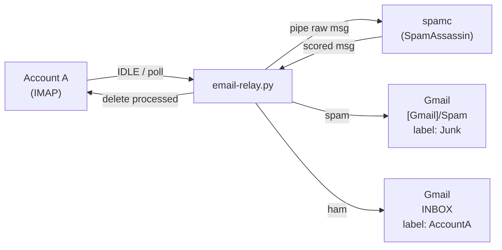

# Email Relay Pipeline (Account A → SpamAssassin → Gmail)

## Architecture



## Components

- **Fetch mail** -- Python `imapclient` connects to Account A, uses IMAP IDLE for push (falls back to polling if POP3-only)
- **Spam filter** -- `spamassassin` package (`spamd` daemon + `spamc` client) via apt
- **Deliver to Gmail** -- Python `imapclient` APPEND to correct folder, COPY to add labels
- **Keep alive** -- `systemd` service with auto-restart
- **Config** -- INI file with credentials + settings

## File Layout

```
/opt/email-relay/
  email_relay.py      # main script
  config.ini          # credentials & settings (chmod 600)
  requirements.txt    # imapclient
/etc/systemd/system/
  email-relay.service  # systemd unit
```

## Gmail Delivery Logic

- **Ham**: APPEND to label folder (e.g. `MySourceAccount`), then COPY to `INBOX` -- message appears in Inbox with the custom label.
- **Spam**: APPEND to `[Gmail]/Spam` with an additional `Junk` label applied via STORE.

Gmail requires an **App Password** (Settings > Security > 2FA > App Passwords) since regular passwords are blocked for IMAP.

## SpamAssassin Setup

- `sudo apt install spamassassin spamc`
- Enable and start `spamd.service`
- Default config is fine; optional: tune `/etc/spamassassin/local.cf` (threshold, Bayes, network checks)
- Script calls `spamc` via subprocess, checks `X-Spam-Status` header in returned message

## Script Behavior

1. Connect to Account A via IMAP SSL, SELECT INBOX
2. Enter IDLE loop (re-IDLE every 29 min per RFC)
3. On new mail: FETCH each message (RFC822)
4. Pipe raw bytes through `spamc -E` (returns scored message, exit code 1 = spam)
5. Connect to Gmail IMAP (persistent connection, reconnect on error)
6. If spam: `APPEND` to `[Gmail]/Spam`; add label `Junk`
7. If ham: `APPEND` to label folder (auto-created); `COPY` to `INBOX`
8. On successful delivery: STORE `\Deleted` on Account A, EXPUNGE
9. Loop back to IDLE
10. Robust error handling: reconnect on socket/IMAP errors, log to journald

## POP3 Fallback (if Account A lacks IMAP)

Replace IDLE loop with a polling loop (`time.sleep(120)`). Use `poplib` to fetch and delete.

## systemd Service

```ini
[Unit]
Description=Email Relay (Account A -> Gmail)
After=network-online.target spamassassin.service
Wants=network-online.target

[Service]
Type=simple
ExecStart=/usr/bin/python3 /opt/email-relay/email_relay.py
Restart=always
RestartSec=30
User=email-relay
ProtectHome=yes

[Install]
WantedBy=multi-user.target
```

## Setup Steps

1. Install OS packages: `sudo apt install spamassassin spamc python3-pip`
2. Enable spamd: `sudo systemctl enable --now spamassassin`
3. Create service user: `sudo useradd -r -s /usr/sbin/nologin email-relay`
4. Create `/opt/email-relay/`, install pip deps, deploy script + config
5. Set permissions: `chmod 600 config.ini; chown -R email-relay: /opt/email-relay/`
6. Generate Gmail App Password, fill in `config.ini`
7. Install and enable systemd service
8. Verify: `journalctl -u email-relay -f`